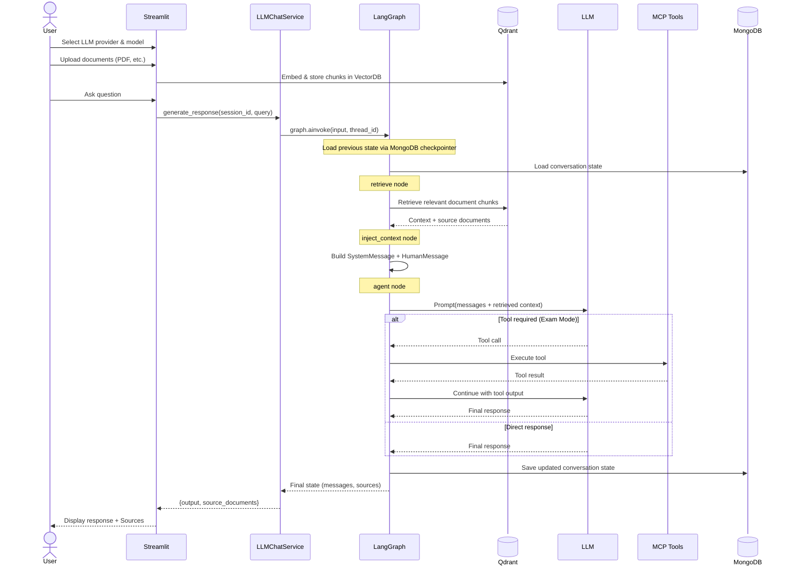

# Study Pal - RAG Powered AI Study Assistant

A Retrieval-Augmented Generation (RAG) chatbot built with LangChain, LangGraph and Streamlit that lets users upload documents, ask questions about them and create exam tests based on the uploaded documents. 
The assistant answers and generates the HTML-formatted exam by using the content of the uploaded files as a knowledge base, enriched with persistent chat history per user and subject. This is automatically done by using LangGraph acts as an orchestrator. Instead of manually calling retrieval, the LLM, tools, and chat history, a workflow (graph), and LangGraph executes it while managing state between each step.

---

## Features
 
- 📄 **Document ingestion** — Upload PDF, PPTX and DOCX files, parsed with high-resolution structure extraction via `UnstructuredLoader`
- 🔍 **Semantic search** — Relevant document chunks are retrieved from a Qdrant vector database on every query
- 🧠 **Persistent chat history** — Conversations are stored per session in MongoDB, surviving restarts
- 🤖 **Multiple LLM providers** — Configurable LLM provider and model at runtime
- 🤖 **Agentic orchestration of execution** — LangGraph workflow engine that automatically manages state, conversation history, execution order, and the agent's reasoning/tool-calling loop  
- 📚 **Source transparency** — Every response surfaces the source documents it was based on
- 🖥️ **Streamlit UI** — Simple chat interface with a collapsible sources expander

---

## Architecture



---

## Tech Stack

| Layer | Technology |
|-------|------------|
| UI | [Streamlit](https://streamlit.io/) |
| LLM orchestration | [LangChain](https://www.langchain.com/) |
| LLM orchestration | [LangGraph](https://www.langchain.com/langgraph) |
| Document parsing | [Unstructured](https://unstructured.io/) (`langchain-unstructured`) |
| Vector database | [Qdrant](https://qdrant.tech/) |
| Chat history | [MongoDB](https://www.mongodb.com/) (`langchain-mongodb`) |
| Containerization | Docker / Docker Compose |

---
 
## Getting Started

### Prerequisites
 
- Python 3.11+
- Docker and Docker Compose

### 1. Clone the repository

```bash
git clone https://github.com/marco-fpereira/study_pal
cd your-repo
```

### 2. Configure environment variables

Using the `env-template.txt` file as a base, create a .env file inside the `app` directory

```env
COLLECTION_NAME=documents
QDRANT_PROTOCOL=http
QDRANT_HOST=localhost
QDRANT_PORT=6333
QDRANT_EMBEDDING_MODEL=sentence-transformers/all-MiniLM-L6-v2
QDRANT_EMBEDDING_DIMENSION=384
GROQ_API_KEY={your_groq_api_key}
OPENAI_API_KEY={your_openai_api_key}
GEMINI_API_KEY={your_gemini_api_key}
MONGO_HOST=localhost
MONGO_PORT=27017
MONGO_DATABASE_NAME=chat_history_db
MONGO_USERNAME={your_username}
MONGO_PASSWORD={your_password}
VECTOR_DB_PARSING_STRATEGY=fast
```

> ⚠️ Never commit `.env` to version control. It is listed in `.gitignore`.

> ⚠️ Create two environment variables in your machine before creating the containers (You can set any preferred value for them):
- MONGO_USERNAME
- MONGO_PASSWORD

### 3. Start infrastructure

> [!WARNING]
Make sure your docker engine is running before executing the command

```bash
cd infra/
docker compose up -d
```

This starts:
 
- **MongoDB** on port `27017`
- **Mongo Express** (database UI) on port `8081`
- **Qdrant** on port `6333`


#### 3.1. Make sure Qdrant is running:
```bash
curl http://localhost:6333/collections
```

It should show a content like this:
```
StatusCode        : 200
StatusDescription : OK
Content           : {"result":{"collections":[]},"status":"ok","time":0.000021367}
``` 

#### 3.2. Make sure MongoDB is running:
```bash
docker ps | grep mongo
```

It should return both `mongo` and `mongo-express` containers

### 4. Create a **uv** virtual environment
```bash
uv venv --python 3.11
```


### 5. Install Python dependencies

```bash
uv sync
```

> [!WARNING]
You may also need system deps depending on your OS/container: usually installing poppler and tesseract is enough for the project to be able to extract and read the files properly.
For tesseract, in addition to install the program itself, if your files are not in english, you may need to install the official tessdata package for the languages of your documents and paste int in the tessdata folder. 
    Example for portuguese: https://github.com/tesseract-ocr/tessdata/raw/main/por.traineddata


### 6. Start MCP Server

```bash
cd infra/mcp-server
uv run question_generator_server.py
```

This starts:
 
- **Question Generator Server** on port `8000`

It contains two tools:
- **generate_exam_questions** - Generate multiple choice questions based on provided content. Returns a JSON array of questions with options, correct answer, and explanations.
- **generate_exam_html** - Convert a list of questions into a standalone interactive HTML exam. Input is a JSON array of questions with options, correct answer, and explanations.


### 7. Run the application
In the `app` directory, execute:

```bash
streamlit run main.py
```

---
 
## Configuration

| Variable | Description | Default |
|---|---|---|
| `MONGO_USERNAME` | MongoDB root username | — |
| `MONGO_PASSWORD` | MongoDB root password | — |

The LLM provider, model, and temperature are configurable at runtime through the Streamlit UI.


## Project Structure

```
├───app
│   │   .env                                    # Environment variables (not committed)
│   │   env-template.txt                        # Environment variables template
│   │   main.py                                 # Streamlit entry point
│   │   
│   ├───config
│   │       mcp_config.py                       # MCP Server configuration
│   │       qdrant_config.py                    # Qdrant Vector Database configuration
│   │       
│   ├───model
│   │   └───enum
│   │           llm_enum.py                     # LLM provider definitions
│   │           mcp_tool_enum.py                # Enum of the available MCP Servers
│   │           user_session_type_enum.py       # Enum of the options for user session types
│   │           
│   ├───repository
│   │       mcp_repository.py                   # MCP repository for handling MCP calls
│   │       mongodb_chat_history_repository.py  # MongoDB Database repository for handling chat history
│   │       vector_db_repository.py             # Qdrant Vector Database repository
│   │       
│   ├───service
│   │       llm_chat_service.py                 # Conversational AI orchestration combining RAG, memory, and agent execution.
│   │       mcp_service.py                      # Service for discovering and invoking MCP tools
│   │       
│   └───utils
│           file_utils.py                       # Utils for file management
│           language_detector.py                # Detect main language of the uploaded files 
│           
└───infra
|   │   docker-compose.yml                      # MongoDB + Mongo Express + Qdrant infrastructure
|   |
│   └───mcp-server
│           .env                                # Environment variables (not committed)
│           env-template.txt                    # Environment variables template
│           question_generator_server.py        # MCP server with tools for generating questions and generating HTML for exam mode
```

---

## How It Works

1. **Document ingestion** — Uploaded files are parsed by `UnstructuredLoader` using `hi_res` strategy to preserve semantic structure (headings, paragraphs, tables) or `fast` strategy to generate faster ingestion. The resulting chunks are embedded and stored in Qdrant.
2. **Query handling** — When a user asks a question, `LLMChatService` uses LangGraph as the workflow engine to load the session's chat history from MongoDB, retrieve the most relevant document chunks from Qdrant, build a prompt containing the context, history, and user query.
3. **Exam questions generation** -  Generates exam questions and its related HTML-based presentation to test user knowledge about the uploaded files. User can choose specific topics under the files or generate the exam about the whole documents.
3. **Response generation** — The LLM generates a response grounded in the retrieved context. The response and updated history are persisted back to MongoDB, and the source documents are surfaced in the UI (included the HTML of the exam, when requested).
